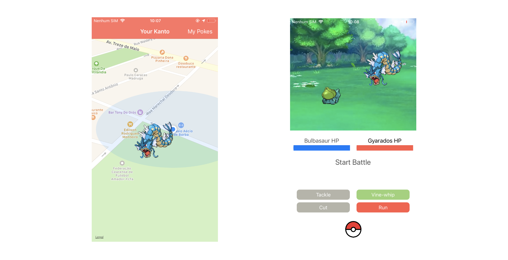
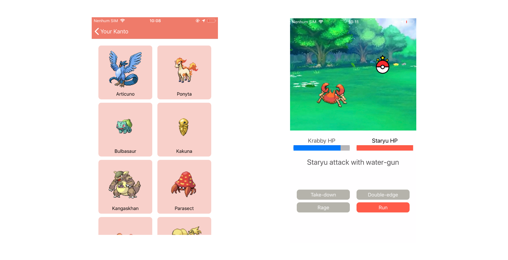

# Pokcatch
Pokemon GO 2D with mini battles

Using maps and API consume.
Pockatch uses PokéAPI a RESTful Pokémon API to retrive pokemons to your kanto.

The Pokcatch was developed to Personal Nano Challenge at Apple Developer Academy. My quest: Made an app that consume an API
and use delegate pattern to biding, in one week. Using [PokéAPI](https://pokeapi.co/), Pokcatch get some pokemons
to provide a "Pokemon GO" experience.

## Screenshots

## License

The project does not need a license :)
